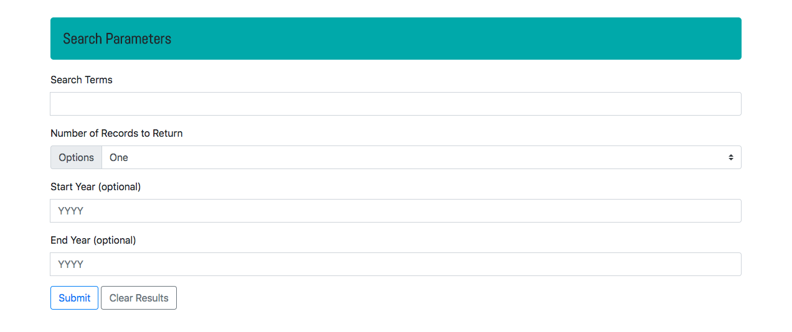

New York Times API

This exercise was coded alongside a UC Davis coding bootcamp video. Through this exercise, I demonstrated the ability to use pre-existing parameters to display results. 

Technologies used: HTML/CSS, Bootstrap, JQuery, JavaScript, AJAX calls. Used localhost via MAMP to work on the project locally. 

Challenges I faced: 

1. One of the challenges of this assignment is that the New York Times API formats its article time search parameters in the following format: YYYYMMDD. However, the requirements for this assignment were to accept the input YYYY. To circumvent this inequivalency in input and output, I tacked on data to the end of the user inputted YYYY. For starting year, I added 0101 to represent the beginning of that year. For ending year, I added 1231 to gather content all the way up to the end of that year.
2. I was having a recurring cross origin issue. I thoroughly researched the possible causes for the issue. I tried adding "crossOrigin: true" to my ajax object. This failed to work for me. After speaking about the issue with another developer, we determined that it would be best to try serving the files through MAMP. This worked and I was able to continue developing and testing the application. 

[Use the app here](https://falondarville.github.io/NYtimesAPI/)
